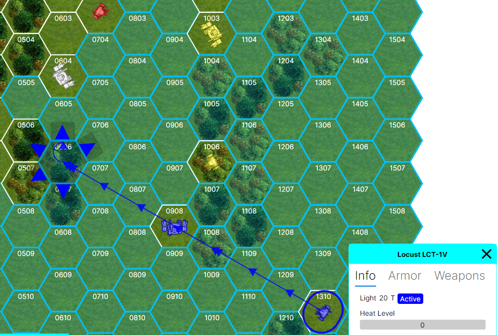

# MekForge

A cross-platform implementation of tactical turn-based mech combat game, inspired by MegaMek. Built with .NET 9 and AvaloniaUI.

## Overview (Planned)

MekForge is an open-source tactical combat game featuring giant walking war machines. The game focuses on strategic combat, unit customization, and both single-player and multiplayer experiences.



## Features
### Implemented
- Hex map generator with the simplest terrain types (clear, light and heavy wood) (MegaMek assets)
- [Client-Server app architecture](https://github.com/anton-makarevich/MekForge/wiki/Game-(Protocol)-High-Level-Architecture) with RX communication for local play 
- Cross-platform support (Windows, Linux, macOS, Web, Android, iOS)
- UI built with AvaloniaUI
- Importing mechs defined in MTF format 

### Planned
- Single-player combat against AI opponents
- Multiplayer support (LAN and Internet, WebSockets/SignalR)
- Unit customization and management
- Compatible with common community data formats

## Technology Stack

- .NET 9
- AvaloniaUI for cross-platform UI
- xUnit for testing

## Project Structure

```
MekForge/
├── src/
│   ├── MekForge.Core/        # Core game engine and logic
│   └── MekForge.Avalonia/    # UI implementation
└── tests/                    # Unit tests
```

### Project Status

- **MekForge.Core**:

[](https://codecov.io/github/anton-makarevich/MekForge)
[](https://github.com/anton-makarevich/MekForge/actions/workflows/core.yml)


## Development Setup

### Prerequisites

- .NET 9 SDK
- Your favorite IDE (Visual Studio, Rider, or VS Code)

### Building

1. Clone the repository
2. Open `MekForge.sln` in your IDE
3. Build the solution

## Contributing

Contributions are welcome! Please feel free to submit a Pull Request.

## License

This project is licensed under the GNU General Public License v3.0 - see the [LICENSE](LICENSE) file for details.

## Acknowledgments

- Inspired by MegaMek (https://megamek.org/)
- Thanks to the BattleTech community for their continued passion.

## Disclaimer

This is a fan-made game and is not affiliated with or endorsed by any commercial mech combat game properties. All trademarks belong to their respective owners.
I'm working on it not to build a game (there are more efficient ways of achieving the same) but just for fun of the process itself.
